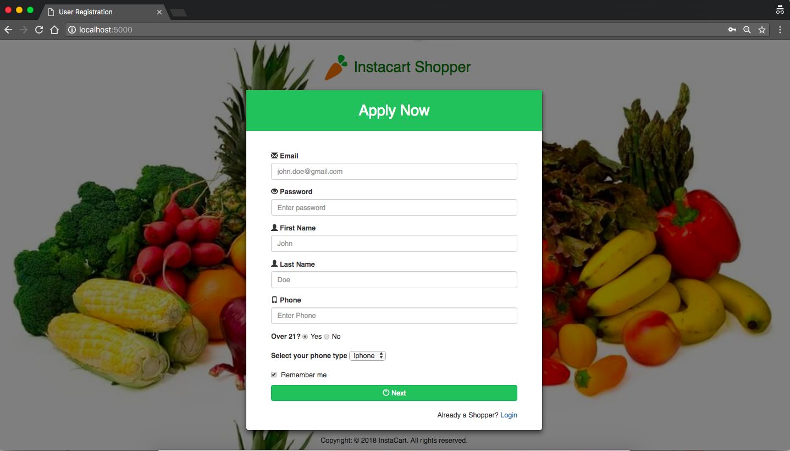
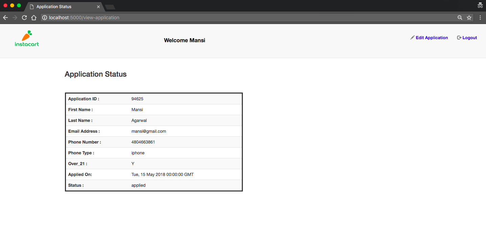

** Please Note: **

    Even though this problem doesn't requires the new applicant to be persisted in database,
    I made my own Postgres database to check if existing user can login. Hence to run the program, please make sure Postgres is installed in your system and createdb 'instacart_shoppers'.
    I am not persisting the new users in databaseas per the requirement, instead just displaying it on console

## Table of Contents
* [Technologies used](#technologiesused)
* [Setup](#setup)
* [Files](#files)
* [Description of End-Points](#endpoints)
* [AJAX](#ajax)
* [Tests](#tests)
* [Running the backend command-line bash script for Part2](#script)


## <a name="technologiesused"></a>Technologies used

* Back-End/Server: Python(v 2.7.12), Flask based server 
* Database & ORM: PostgreSQL, Flask SQLAlchemy
* Front-End/Client: AJAX, Javascript, Jinja, jQuery
* Styling: Bootstrap, HTML-5/CSS


## <a name="setup"></a>SetUp

Before running, make sure python(2.7.12) and Postgres is installed on your machine.
Clone this repo and cd into cloned repo. Then do the following steps:
````
1) > virtualenv env
2) > source env/bin/activate
3) > pip install -r requirements.txt
4) > createdb instacart_shoppers
5) > seed database if you like (refer to model.py for schema)
6) > python server.py (this step will start the server on port 5000)

Landing page :
`http://localhost:5000/`

````
 


## <a name="files"></a>Files

* server.py -> Flask based server file that contains all api end-points
* model.py -> contains database schema
* tests.py -> contains integration tests
* applicant_analysis.sh -> bash script for doing analysis of applicants' status
* templates/* -> HTML files
* static/css/* -> Styling files

## <a name="endpoints"></a>Description of API end-points

* A modal window will be displayed on landing page which will ask new applicants to register
* If user already has account he can login
```
Landing page :
    http://localhost:5000/
```

* After the confirmation page, following type of applicant information is printed on console:
```
{'_id': 31365,
 'date_applied': datetime.date(2018, 5, 15),
 'email': u'man@gmail.com',
 'first_name': u'ADVANCED',
 'last_name': u'DEVICES',
 'over_21': u'Y',
 'phone': u'4087494000',
 'phone_type': u'iphone',
 'status': 'applied'}
```

* **Flask Sessions**
    
 Used flask session to store email of logged in user.

* Here is a view of Application Status Page (Please see screenshots folder for detailed user flow)
 


## <a name="ajax"></a> AJAX

Following functions are happening via an ajax request :
* Login credentials check
* Register a new applicant
* Edit existing application

## <a name="tests"></a> Tests

In order to run tests, please run the following command
```
 > Ctrl-C to stop the main server if its running
 > python tests.py
```


## <a name="script"></a> Running the backend command-line bash script for Part2

* applicant_analysis.sh is the executable bash script that emits CSV data creating weekly workflow
* Please make sure that the database file 'applicants.sqlite3' is in the same directory as applicant_analysis.sh
* Please make sure sqlite3 is installed in that directory
* run the script as follows:
```
./applicant_analysis.sh start_date end_date
For example,
./applicant_analysis.sh "2014-01-01" "2015-01-01"
```

Sample Output will look like this on the console:

```
1489,2014-12-08,hired
3061,2014-12-08,onboarding_completed
4696,2014-12-08,onboarding_requested
6171,2014-12-08,quiz_completed
7745,2014-12-08,quiz_started
9830,2014-12-15,applied
1622,2014-12-15,hired
3296,2014-12-15,onboarding_completed
4799,2014-12-15,onboarding_requested
6410,2014-12-15,quiz_completed
8207,2014-12-15,quiz_started
10120,2014-12-22,applied
1658,2014-12-22,hired
3337,2014-12-22,onboarding_completed
5208,2014-12-22,onboarding_requested
6714,2014-12-22,quiz_completed
8463,2014-12-22,quiz_started
5918,2014-12-29,applied
960,2014-12-29,hired
1956,2014-12-29,onboarding_completed
3022,2014-12-29,onboarding_requested
4080,2014-12-29,quiz_completed
5015,2014-12-29,quiz_started
```


